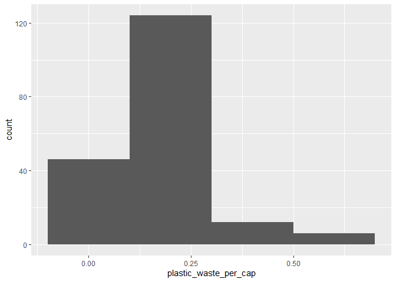

Lab 02 - Plastic waste
================
Kenan Chantemesse
15.09.2025

## Chargement des packages et des données

``` r
library(tidyverse) 
```

``` r
plastic_waste <- read_csv("data/plastic-waste.csv")
```

Commençons par filtrer les données pour retirer le point représenté par
Trinité et Tobago (TTO) qui est un outlier.

``` r
ggplot(plastic_waste, 
       aes(x = plastic_waste_per_cap)) +
  geom_histogram(binwidth = 0.2)
```

    ## Warning: Removed 51 rows containing non-finite outside the scale range
    ## (`stat_bin()`).

<!-- -->

``` r
plastic_waste %>%
  filter(plastic_waste_per_cap > 3.5)
```

    ## # A tibble: 1 × 10
    ##   code  entity              continent     year gdp_per_cap plastic_waste_per_cap
    ##   <chr> <chr>               <chr>        <dbl>       <dbl>                 <dbl>
    ## 1 TTO   Trinidad and Tobago North Ameri…  2010      31261.                   3.6
    ## # ℹ 4 more variables: mismanaged_plastic_waste_per_cap <dbl>,
    ## #   mismanaged_plastic_waste <dbl>, coastal_pop <dbl>, total_pop <dbl>

``` r
plastic_waste <- plastic_waste %>%
  filter(plastic_waste_per_cap < 3.5)
```

## Exercices

### Exercise 1

``` r
ggplot(plastic_waste,
       aes(x = plastic_waste_per_cap)) +
  geom_histogram(binwidth = 0.2)
```

<!-- -->

``` r
facet_wrap(plastic_waste ~ continent, ncol =3)
```

    ## <ggproto object: Class FacetWrap, Facet, gg>
    ##     compute_layout: function
    ##     draw_back: function
    ##     draw_front: function
    ##     draw_labels: function
    ##     draw_panels: function
    ##     finish_data: function
    ##     init_scales: function
    ##     map_data: function
    ##     params: list
    ##     setup_data: function
    ##     setup_params: function
    ##     shrink: TRUE
    ##     train_scales: function
    ##     vars: function
    ##     super:  <ggproto object: Class FacetWrap, Facet, gg>

### Exercise 2

``` r
# insert code here
```

Réponse à la question…

### Exercise 3

Boxplot:

``` r
# insert code here
```

Violin plot:

``` r
# insert code here
```

Réponse à la question…

### Exercise 4

``` r
# insert code here
```

Réponse à la question…

### Exercise 5

``` r
# insert code here
```

``` r
# insert code here
```

Réponse à la question…

## Conclusion

Recréez la visualisation:

``` r
# insert code here
```
