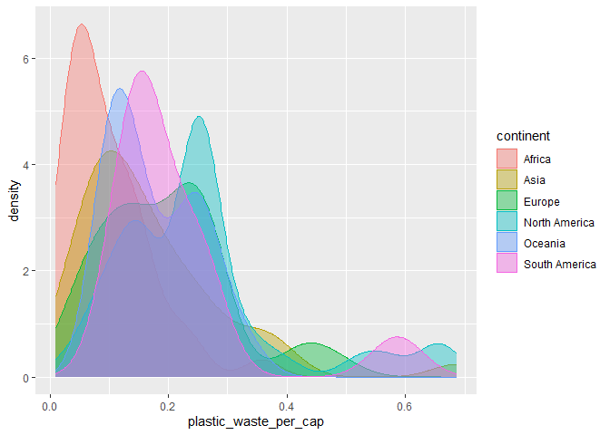
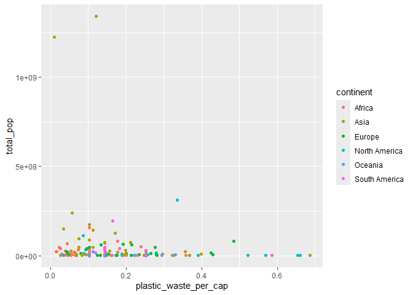
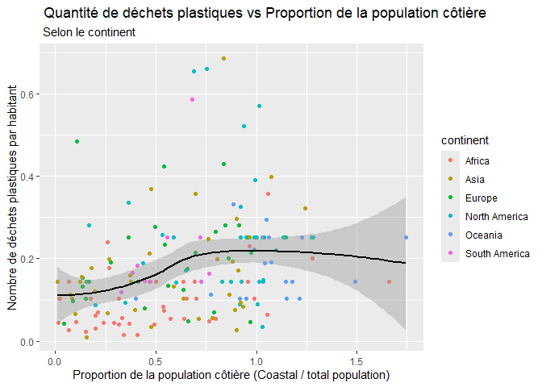

Lab 02 - Plastic waste
================
Kenan Chantemesse
15.09.2025

## Chargement des packages et des données

``` r
library(tidyverse) 
```

``` r
plastic_waste <- read_csv("data/plastic-waste.csv")
```

Commençons par filtrer les données pour retirer le point représenté par
Trinité et Tobago (TTO) qui est un outlier.

``` r
ggplot(plastic_waste, 
       aes(x = plastic_waste_per_cap)) +
  geom_histogram(binwidth = 0.2)
```

    ## Warning: Removed 51 rows containing non-finite outside the scale range
    ## (`stat_bin()`).

<!-- -->

``` r
plastic_waste %>%
  filter(plastic_waste_per_cap > 3.5)
```

    ## # A tibble: 1 × 10
    ##   code  entity              continent     year gdp_per_cap plastic_waste_per_cap
    ##   <chr> <chr>               <chr>        <dbl>       <dbl>                 <dbl>
    ## 1 TTO   Trinidad and Tobago North Ameri…  2010      31261.                   3.6
    ## # ℹ 4 more variables: mismanaged_plastic_waste_per_cap <dbl>,
    ## #   mismanaged_plastic_waste <dbl>, coastal_pop <dbl>, total_pop <dbl>

``` r
plastic_waste <- plastic_waste %>%
  filter(plastic_waste_per_cap < 3.5)
```

## Exercices

Je n’ai pas anticipé ce résultat, car Trinidad and Tobago est une petite
île. Il est donc surprenant que sa quantité de déchets plastiques par
habitant en kg/jour soit significative.

### Exercise 1

``` r
ggplot(plastic_waste,
       aes(x = plastic_waste_per_cap)) +
  geom_histogram(binwidth = 0.2) +
facet_wrap(~ continent)
```

<!-- -->

Selon le graphique, l’Afrique a une quantité de quantité de déchets
plastiques par habitant moins élevé que l’Europe. Par ailleurs,
l’Amérique du Sud est le continent rejetant le moins de déchets
plastique.

### Exercise 2

``` r
ggplot(plastic_waste,
       aes(x = plastic_waste_per_cap, color = continent, fill = continent)) +
geom_density(alpha = 0.4)
```

<!-- -->

Dans ce graphe, color et fill sont placés dans aes pour que ces
variables soient propres à chaque courbe. Au contraire, alpha est placé
dans geom_density pour que cette valeur soit fixe, car nous voulons la
même transparence pour chaque courbe.

### Exercise 3

Boxplot:

``` r
ggplot(plastic_waste,
       aes(x = continent, y = plastic_waste_per_cap)) +
  geom_boxplot()
```

<!-- -->

Violin plot:

``` r
ggplot(plastic_waste,
       aes(x = continent, y = plastic_waste_per_cap)) +
  geom_violin()
```

<!-- -->

Réponse à la question…

### Exercise 4

``` r
ggplot(plastic_waste, 
       aes(x = plastic_waste_per_cap, 
           y = mismanaged_plastic_waste_per_cap,
           color = continent)) +
  geom_point()
```

<!-- -->

Réponse à la question…

### Exercise 5

``` r
ggplot(plastic_waste, 
       aes(x = plastic_waste_per_cap, 
           y = total_pop,
           color = continent)) +
  geom_point()
```

    ## Warning: Removed 10 rows containing missing values or values outside the scale range
    ## (`geom_point()`).

<!-- -->

``` r
ggplot(plastic_waste, 
       aes(x = plastic_waste_per_cap, 
           y = coastal_pop,
           color = continent)) +
  geom_point()
```

<!-- -->

Réponse à la question…

## Conclusion

Recréez la visualisation:

``` r
ggplot(plastic_waste, 
       aes(x = coastal_pop, 
           y = plastic_waste_per_cap,
           color = continent)) +
  geom_point() +
  labs(title = " Quantité de déchets plastiques vs Proportion de la population côtière ", subtitle = " Selon le continent ", x = "Proportion de la population côtière (Coastal / total population)", y = "Nombre de déchets plastiques par habitant" )
```

<!-- -->
