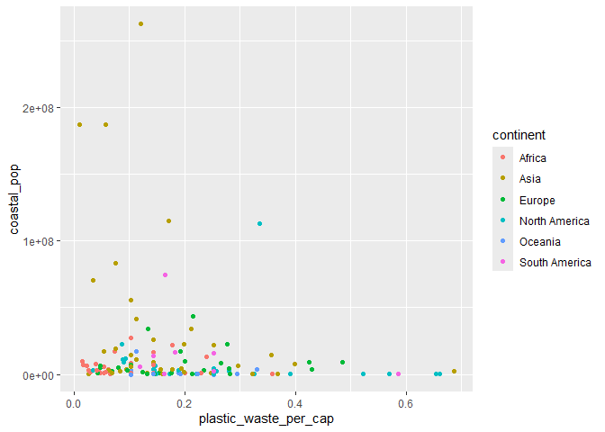

Lab 02 - Plastic waste
================
Kenan Chantemesse
15.09.2025

## Chargement des packages et des données

``` r
library(tidyverse) 
```

``` r
plastic_waste <- read_csv("data/plastic-waste.csv")
```

Commençons par filtrer les données pour retirer le point représenté par
Trinité et Tobago (TTO) qui est un outlier.

``` r
ggplot(plastic_waste, 
       aes(x = plastic_waste_per_cap)) +
  geom_histogram(binwidth = 0.2)
```

    ## Warning: Removed 51 rows containing non-finite outside the scale range
    ## (`stat_bin()`).

<!-- -->

``` r
plastic_waste %>%
  filter(plastic_waste_per_cap > 3.5)
```

    ## # A tibble: 1 × 10
    ##   code  entity              continent     year gdp_per_cap plastic_waste_per_cap
    ##   <chr> <chr>               <chr>        <dbl>       <dbl>                 <dbl>
    ## 1 TTO   Trinidad and Tobago North Ameri…  2010      31261.                   3.6
    ## # ℹ 4 more variables: mismanaged_plastic_waste_per_cap <dbl>,
    ## #   mismanaged_plastic_waste <dbl>, coastal_pop <dbl>, total_pop <dbl>

``` r
plastic_waste <- plastic_waste %>%
  filter(plastic_waste_per_cap < 3.5)
```

## Exercices

Je n’ai pas anticipé ce résultat, car Trinidad and Tobago est une petite
île. Il est donc surprenant que sa quantité de déchets plastiques par
habitant en kg/jour soit significative.

### Exercise 1

``` r
ggplot(plastic_waste,
       aes(x = plastic_waste_per_cap)) +
  geom_histogram(binwidth = 0.2) +
facet_wrap(~ continent)
```

<!-- -->

Selon le graphique, l’Afrique a une quantité de quantité de déchets
plastiques par habitant moins élevé que l’Europe. Par ailleurs,
l’Amérique du Sud est le continent rejetant le moins de déchets
plastique.

### Exercise 2

``` r
ggplot(plastic_waste,
       aes(x = plastic_waste_per_cap, color = continent, fill = continent)) +
geom_density(alpha = 0.4)
```

<!-- -->

Dans ce graphe, color et fill sont placés dans aes pour que ces
variables soient propres à chaque courbe. Au contraire, alpha est placé
dans geom_density pour que cette valeur soit fixe, car nous voulons la
même transparence pour chaque courbe.

### Exercise 3

Boxplot:

``` r
ggplot(plastic_waste,
       aes(x = continent, y = plastic_waste_per_cap)) +
  geom_boxplot()
```

<!-- -->

Violin plot:

``` r
ggplot(plastic_waste,
       aes(x = continent, y = plastic_waste_per_cap)) +
  geom_violin()
```

<!-- -->

Le graphe violin plot permet de voir en plus la forme de la distribution
des valeurs.

### Exercise 4

``` r
ggplot(plastic_waste, 
       aes(x = plastic_waste_per_cap, 
           y = mismanaged_plastic_waste_per_cap,
           color = continent)) +
  geom_point()
```

<!-- -->

Selon le graphique, l’Europe et l’Amérique du Nord ont la quantité de
déchet par habitant par jour la plus élevé mais les taux les plus bas de
déchet non gérés. Cette analyse est censée, car les continent plus
pauvres font logiquement moins de déchet mais n’ont pas les ressources
pour gérer ceux-ci.

### Exercise 5

``` r
ggplot(plastic_waste, 
       aes(x = plastic_waste_per_cap, 
           y = total_pop,
           color = continent)) +
  geom_point()
```

    ## Warning: Removed 10 rows containing missing values or values outside the scale range
    ## (`geom_point()`).

<!-- -->

``` r
ggplot(plastic_waste, 
       aes(x = plastic_waste_per_cap, 
           y = coastal_pop,
           color = continent)) +
  geom_point()
```

<!-- -->

La comparaison des graphiques montre que les habitants prochent des
côtes ont tendance à faire plus de déchet que la population générale. En
efftet, l’Afrique est très peuplé, donc il y a plus de personnes aux
côtes rejetant des déchets.

## Conclusion

Recréez la visualisation:

``` r
ggplot(plastic_waste, 
       aes(x = (coastal_pop / total_pop), 
           y = plastic_waste_per_cap,
           color = continent,)) +
  geom_point() +
    geom_smooth(method = "loess", se = TRUE, color = 'black') +
  labs(title = " Quantité de déchets plastiques vs Proportion de la population côtière ", subtitle = " Selon le continent ", x = "Proportion de la population côtière (Coastal / total population)", y = "Nombre de déchets plastiques par habitant" )
```

    ## `geom_smooth()` using formula = 'y ~ x'

    ## Warning: Removed 10 rows containing non-finite outside the scale range
    ## (`stat_smooth()`).

    ## Warning: Removed 10 rows containing missing values or values outside the scale range
    ## (`geom_point()`).

<!-- --> La courbe de
tendance montre que la quantité de déchets plastiques augmente plus la
population côtière est dense.
